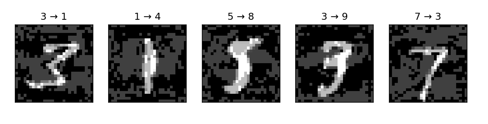
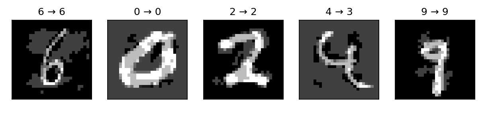

# Projekt SI - Ataki na sieci neuronowe

## Przykład 1. - Atak adwersarialny FGSM na sieć neuronową rozpoznającą cyfry z obrazu
### Stack
```
trenowanie: torch, torchvision
dane: cyfry MNIST
wizualizacja: matplotlib
```
### Parametry modelu
```
- rodzaj: sieć neuronowa feedforward uczona przez propagacje wsteczną
- wejście: obraz z MNIST (28x28 pikseli w skali szarości jako wektor 784-d)
- pierwsza warstwa (fc1): linear, 784 in, 256 out (256 neuronów), aktywacja RELU, 200960 parametrów (784x256 wag + 256 bias)
- druga warstwa (fc2): linear, 256 in, 10 out (cyfry jako klasy), brak aktywacji, wyjście logity, 2570 parametrów (256x10 wag + 10 bias)
- łączna liczba parametrów: 203530
- metoda optymalizacyjna Adam
```
### Instalacja i uruchomienie
```bash
git clone ...
cd przyklad-fgsm
python -m venv venv
venv/Scripts/Activate
pip install torch torchvision matplotlib
python adversarial.py
```
### Przebieg ataku (nieprawidłowy output)


### Wynik po wprowadzeniu przeciwdziałania (trenowanie na zbiorze z FGSM)


### Przeciwdziałanie ataku
